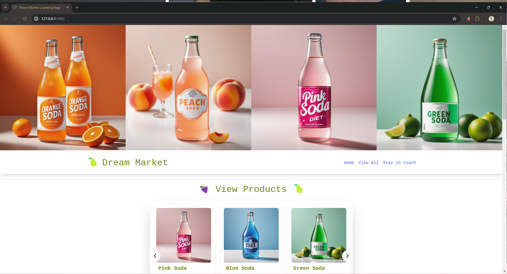
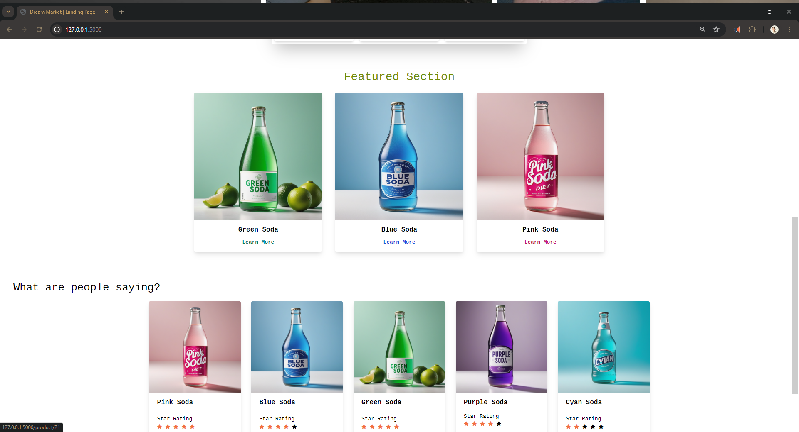
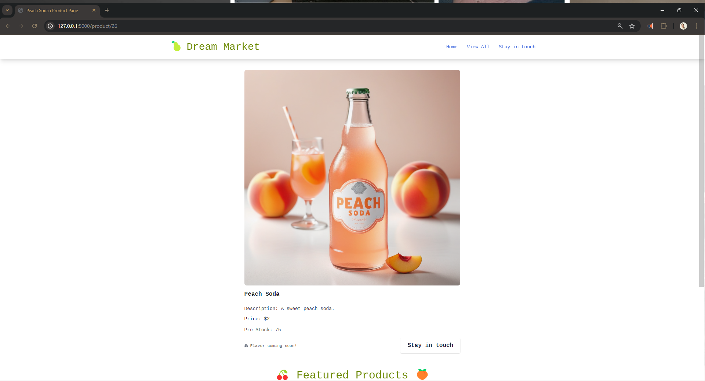
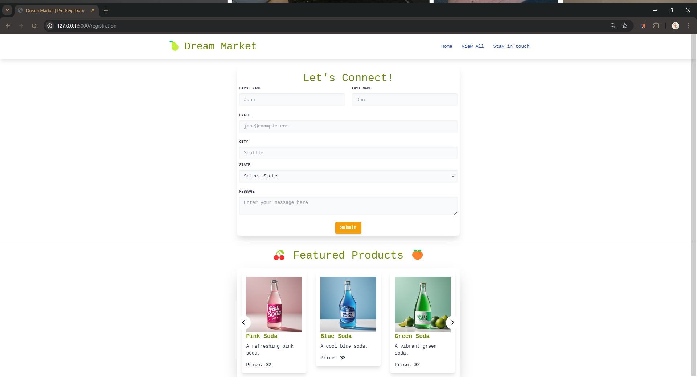
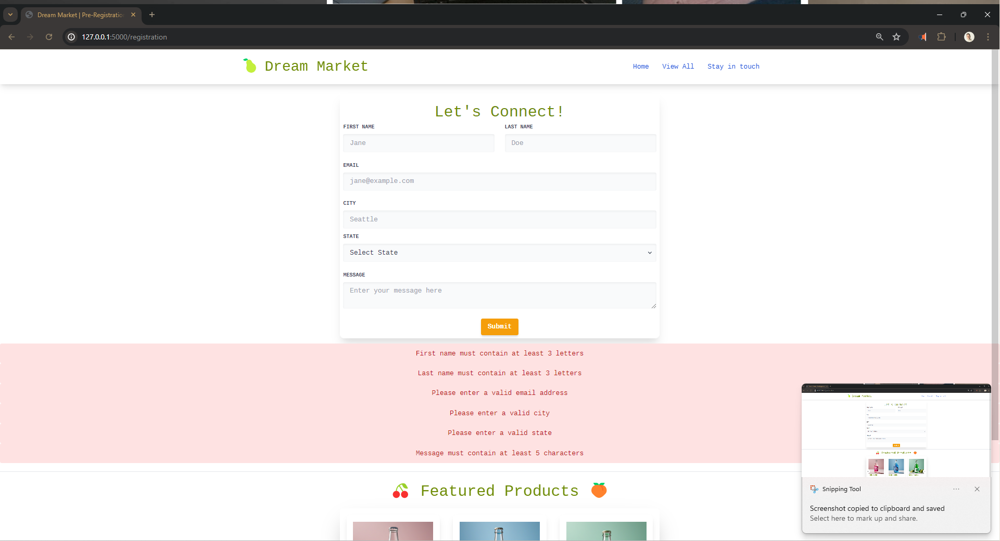
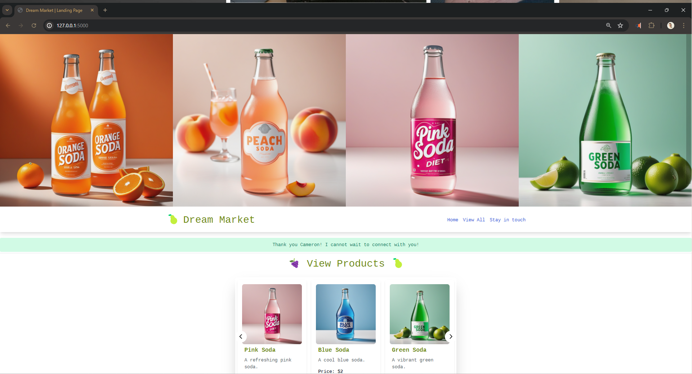
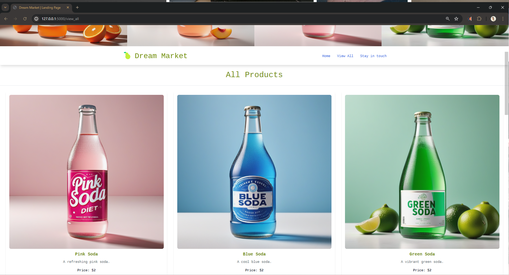
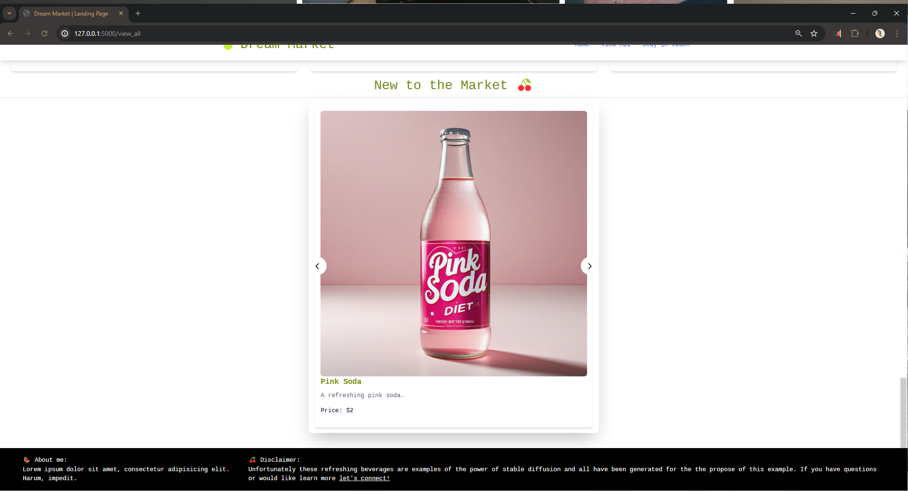

# Flask Capstone Project: DreamMarket 🍐
## A mobile-friendly e-commerce site featuring innovative design and a robust backend

## Overview

This project is my capstone project for the Coding Dojo Flask Stack. It utilizes Flask, MySQL, and features a responsive mobile-friendly design. Key features include carousels, stable diffused images, and Flask-Mail integration to connect with the application owner.

To enjoy the project by check out the screen recordings provided for both desktop and mobile experiences or by installing on to your local machine! 

## Features

- **Flask Framework**: Lightweight WSGI web application framework.
- **MySQL Database**: Robust and scalable database solution.
- **Responsive Design**: Mobile-friendly layout using modern CSS techniques.
- **Carousels**: Dynamic image carousels for showcasing content.
- **Stable Diffused Images**: Enhanced image presentation and stability.
- **Flask-Mail**: Email integration to facilitate communication with the application owner.

## Setup Instructions

1. **Clone the Repository**:
    ```bash
    git clone [<repository-url>](https://github.com/CAngeleri/Angeleri_Dream_Market.git)
    cd <repository-directory>
    ```

2. **Create a Virtual Environment**:
    ```bash
    python -m venv venv
    source venv/bin/activate  # On Windows use `venv\Scripts\activate`
    ```

3. **Install Dependencies**:
    ```bash
    pip install -r requirements.txt
    ```

4. **Configure Database**:
    - Set up your MySQL database.
    - Update the database configuration in `config.py` file.

5. **Run the Application**:
    ```bash
    flask run
    ```

## Usage

- Navigate to `http://127.0.0.1:5000` in your browser to use the application.

## Screenshots & Recordings










[](flask_app/static/imgs/DreamMarketScreenshots/MobileView.mp4)
[](flask_app/static/imgs/DreamMarketScreenshots/DesktopView.mp4)

## Lessons Learned

Throughout this project, I gained a deeper understanding of:

- Building and structuring a Flask application.
- Integrating a MySQL database with a Flask backend.
- Creating responsive and mobile-friendly web designs.
- Implementing carousels for dynamic content display.
- Using Flask-Mail for email functionality.
- Debugging and troubleshooting common issues in web development.

## Contact

For any inquiries, please reach out to me on LinkedIn: [Cameron Angeleri](https://www.linkedin.com/in/cameron-angeleri/)

---

Thank you for checking out my capstone project!
